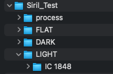
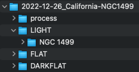

# sirilAutomation
Automated processing of Astronomy images using Siril

## Command Line Execution for DSLR File Processing
Simply run the PreProcess.py file with parameters:-

python3 PreProcess.py -i CANON_DSLR --b <Master bias file path> -t <Target location name> -p <stage> -f <filter FWHM> -w <filter wFWHM> -r <filter Roundness> -d <base directory> -s <Start Index>

The assumption when running the command is that there will be a directory layout as follows if using a DSLR where there are Dark files taken and a master Bias: -

Folders expect to contain *.cr2 raw cannon files.
The 'process' directory is expected to have already been created, any files in this directory with matching names during processing will be overwritten.

## Command Line Execution for ZWO OSC File Processing
Simply run the PreProcess.py file with parameters:-

python3 PreProcess.py -i ZWO_OSC -a <Master dark file path> -t <Target location name> -p <stage> -f <filter FWHM> -w <filter wFWHM> -r <filter Roundness> -d <base directory> -s <Start Index>

The assumption when running the command is that there will be a directory layout as follows if using a ZWO OSC camera where there is a Master Dark file already available and your have taken DarkFlats to act as Bias (Offset files): -

    
Note - although the -i (camera) parameter is set to ZWO_OSC this should work with any modern CMOS colour camera with FITS files as output

### Camera Type -i
Optional - will default to CANON_DSLR if not specified.
Currently CANON_DSLR and ZWO_OSC are the only valid options.  
When DSLR is specified the script expects that there is a master Bias to be used and that the session will have Dark images that must be stacked.  Also, as the camera is not cooled the pre-processing of lights is performed using the dark optimisation option.
When ZWO_OSC is specified the script expects that there is a master Dark and that the session will have DarkFlats that will act as the Bias for pre-processing the Flats.  Dark optimisation is also not used as part of the lights pre-processing.

### Base Directory -d
Optional - if no base directory is provided then the current working directory is assumed to be the directory otherwise provide the path to the base directory.  In the image above, the path to Siril_Test would be the base directory.

### Master dark file path -a
Required if Camera = "ZWO_OSC" - path and name of the master dark file to use to use for the pre-processing of Lights

### Master bias file path -b
Required if Camera = "CANON_DSLR"- path and name of the master Offset file to use to use for the pre-processing of files

### Target location name -t
Required - Source light files are expecting to be in a folder that corresponds to the target.  In the image above, the target would be IC\ 1848 - '\\' encodes the space character.

### Stage -p
Optional - if not provided then full Preprocessing / registration and stacking will be performed,  otherwise tell the script to stop at a stage of your choosing.  This allows manual intervention for example to run a background extraction on each pre processed light, or to manually filter out post registration.
* preproc - create master flats and darks using the master bias, then preprocess the lights using optimised darks option
* reg - perform the registration on all the pre-processed frames.  
* stack - perform the stacking of registered files.  Filters can be provided, otherwise all frames will be used.  See the Filters section.

### Start Index -s
Not currently working due to Siril bug (1.0.5).  Intention is to allow a starting number ot be used as the sequence number for all images, this would allow multi night session to be allocated a block of numbers and therefore make the subsequent registration and stacking of all session files easier as filenames would not overlap.

### Filters 
When performing Stage = stack then the following filters can be defined to remove frames outside of these values.

#### filter FWHM -f
Do not stack frames where the light frame's FWHW values is greater than this value.  Useful number to start with is 3.5, some will think this not strict enough!

#### filter wFWHM -w
Do not stack frames where the light frame's weighted FWHW values is greater than this value.  Useful number to start with is 5, some will think this not strict enough!

#### filter Roundness -r
Do not stack frames where the light frame's Roundness is less than this value.  Useful number to start with is 0.8, 80% roundness is practically indistinguishable from round.
